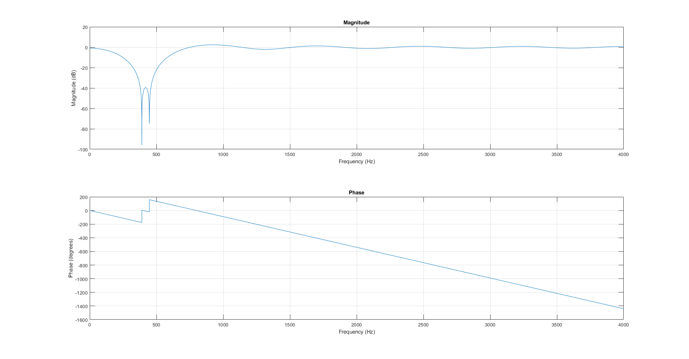
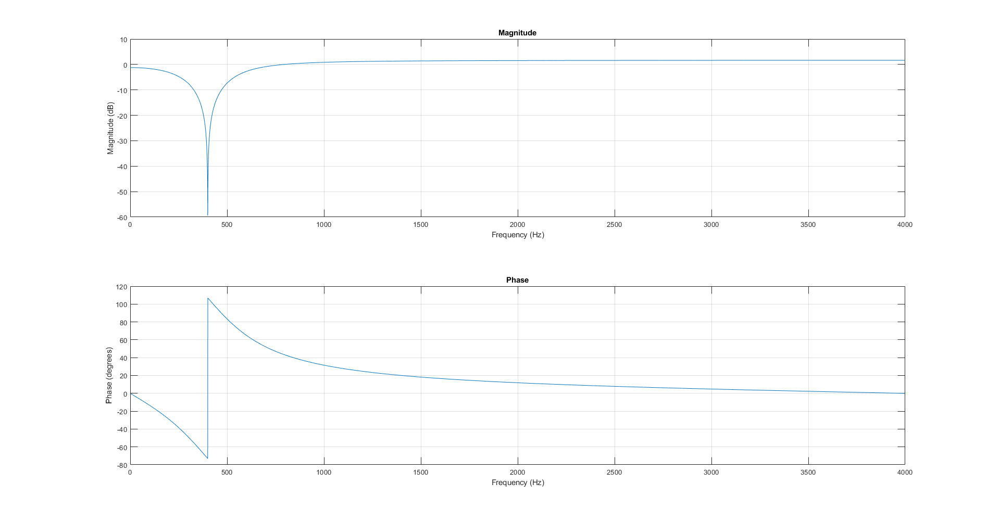

# Comparison of Noise Removal Using IIR and FIR Filters

This project focuses on removing 400Hz noise from signals using both IIR (Infinite Impulse Response) and FIR (Finite Impulse Response) filters.

## Project Overview

### FIR Filter
The FIR filter designed for this project exhibits a cutoff frequency range approximately between 350Hz and 500Hz. It has non-uniform attenuation within this band and does not fully attenuate the exact 400Hz frequency, as indicated by a local maximum around 400Hz. The phase response shows a noticeable change around the cutoff frequencies, indicating phase shifts.

### IIR Filter
The IIR filter's frequency response is influenced by two parameters, A and B. Parameter A significantly impacts the depth and intensity within its cutoff range and introduces phase modifications. Parameter B shifts the cutoff range. The values of A and B were chosen through iterative experimentation to maximize the filter’s efficacy at 400Hz.

- **Optimal values for parameters**:
  - A = 0.82
  - B = 1.902

### Effect of Parameters A & B
- **A**: Affects the depth and intensity of the filter response within its cutoff range and modifies the phase.
- **B**: Responsible for shifting the cutoff range.

### Comparison of FIR and IIR Filters
- **FIR Filter**: 
  - Wider attenuation range (350Hz to 500Hz).
  - Non-uniform attenuation within the band.
  - Noticeable phase shifts around cutoff frequencies.

- **IIR Filter**:
  - Targets a narrower band centered around 400Hz.
  - Provides a more consistent response outside the 400Hz band.
  - Results in a clearer output signal closer to the original frequencies outside the targeted range.

### Reasons for IIR Filter Superiority
The IIR filter demonstrates superior performance in attenuating the 400Hz hum noise due to its targeted narrow band and consistent response. This results in a clearer output signal compared to the FIR filter, which has a broader and less consistent attenuation range.

### Importance of FIR Filters
Despite the superior performance of IIR filters, FIR filters remain indispensable due to:
- Inherent stability.
- Ability to maintain a linear phase response.
- Ease of design and optimization.
- Suitability for applications requiring signal integrity, such as audio and image processing.
- Robust numerical properties and compatibility with modern DSP architectures.